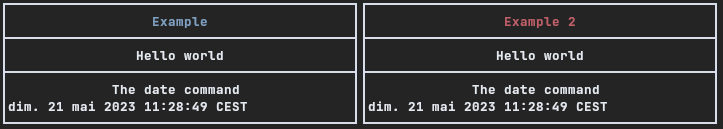

# Bash Simple Curses

[](https://bashsimplecurses.readthedocs.io/en/master/?badge=master)
[](https://app.fossa.io/projects/git%2Bgithub.com%2Fmetal3d%2Fbashsimplecurses?ref=badge_shield)
                

Bash Simple Curses gives you some basic functions to quickly create windows on your terminal.

An example is given: bashbar. Bashbar is a monitoring bar that you can integrate into tiling window managers.

The (unfinished) goal of Bash Simple Curses is to create windows. It is only intended to create colored windows and display information into. But, [with a little tips](https://bashsimplecurses.readthedocs.io/en/master/tips/), you can also make it interactive.

To use this library, you have to import `simple_curses.sh` into your bash script, like so:

```bash

#!/bin/bash

# import library, please check path
#source /usr/lib/simple_curses.sh
source /usr/local/lib/simple_curses.sh

# You must create a "main" function:
main () {
    # Your code here, here we add some windows and text
    window "title" "color"
    append "Text..."
    endwin
}

# Then, execute the loop every second ( -t 1 => 1s)
main_loop -t 1
```

That's all.


## Example

```bash
#!/bin/bash
source simple_curses.sh

main(){
    # create a window
    window "Example" "blue" "50%"
        append "Hello world"
        addsep
        append "The date command"
        append_command "date"
    endwin

    # move on the next column
    col_right

    # and create another window
    window "Example 2" "red" "50%"
        append "Hello world"
        addsep
        append "The date command"
        append_command "date"
    endwin
}
main_loop
```




## Install

There are several possibilities to use the library. We recommend to copy `simple_curses.sh` inside your project and to "source" it.

But, if you want to make it available for the entire system, or for local user, you can use the `make install` command:

```bash
# install inside the system
# in /usr/local/lib
sudo make install

# for local user, no need to use sudo, but change the PREFIX
make install PREFIX=~/.local/lib
```

You can then uninstall the library file:

```bash
sudo make uninstall
make uninstall PREFIX=~/.loca/bin
```

## License
[](https://app.fossa.io/projects/git%2Bgithub.com%2Fmetal3d%2Fbashsimplecurses?ref=badge_large)
